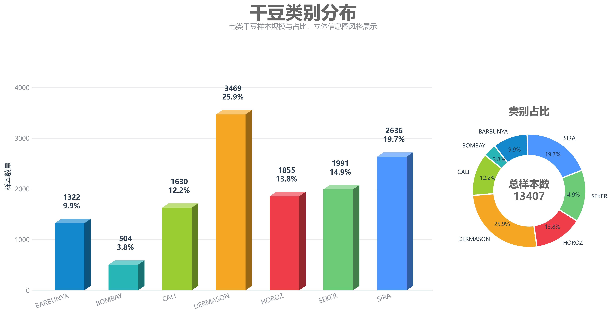
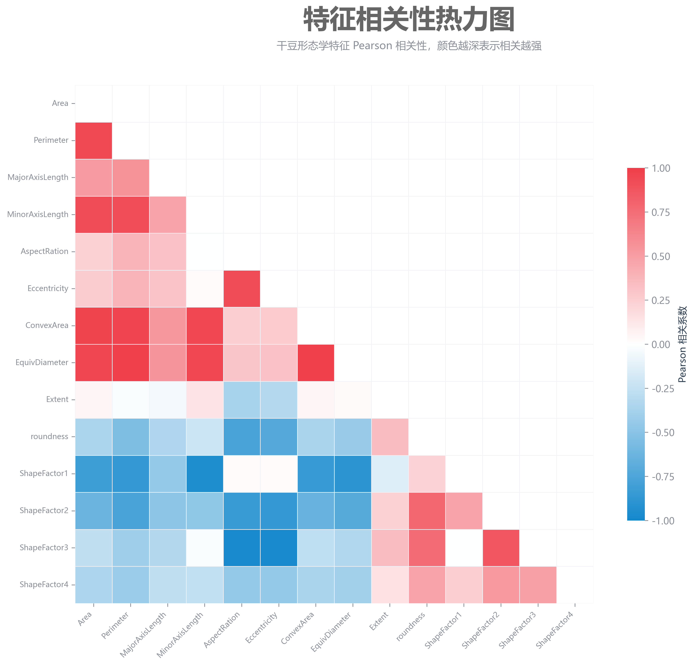
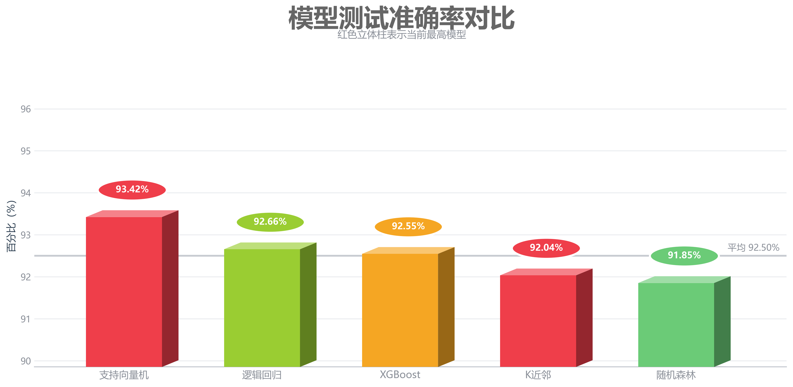
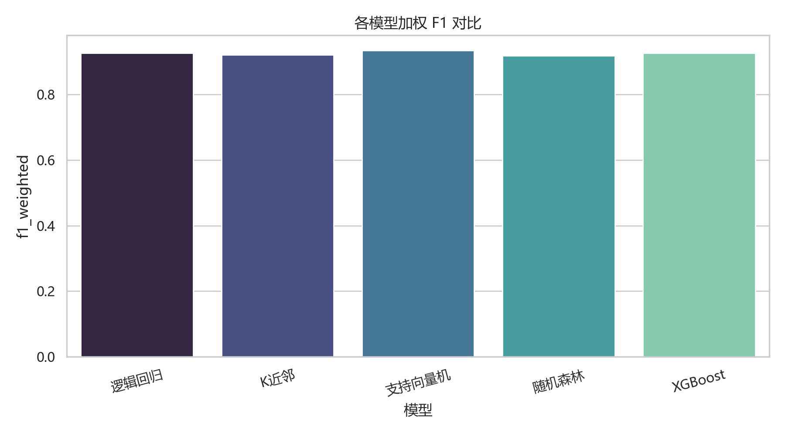
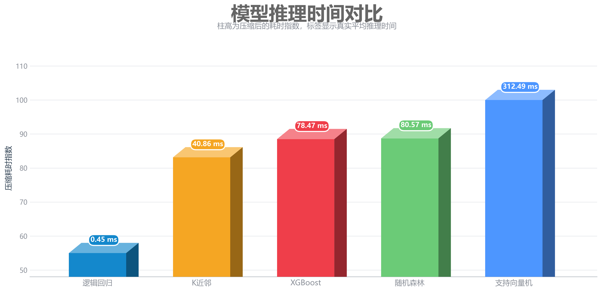
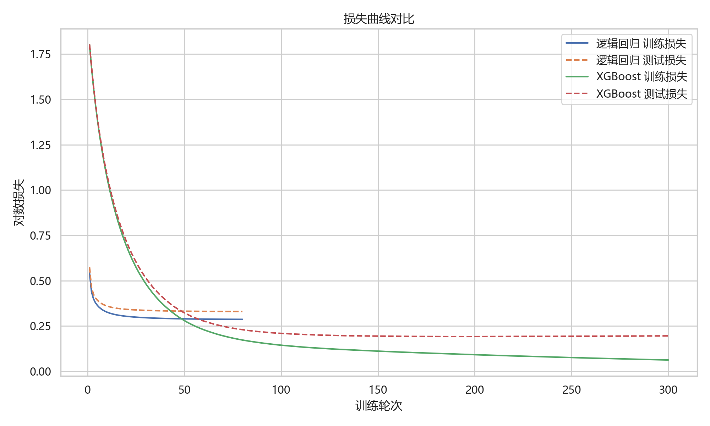
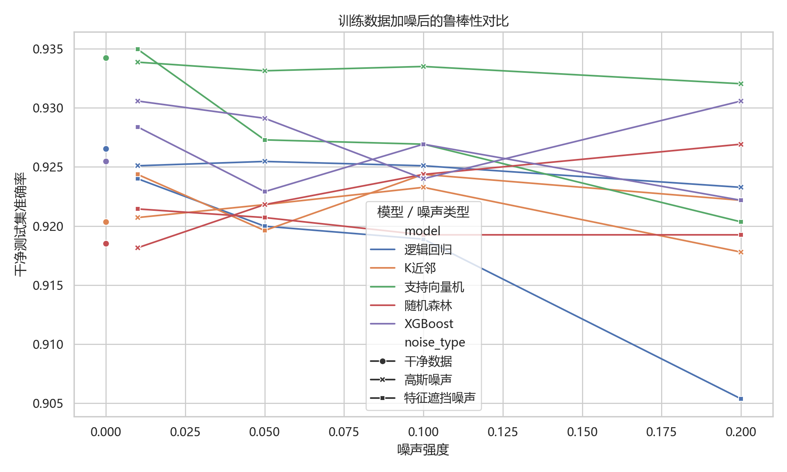
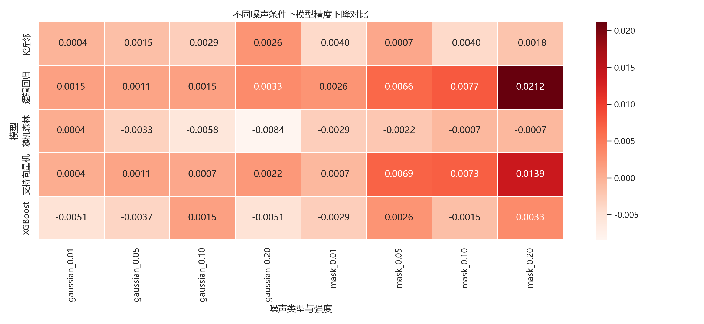
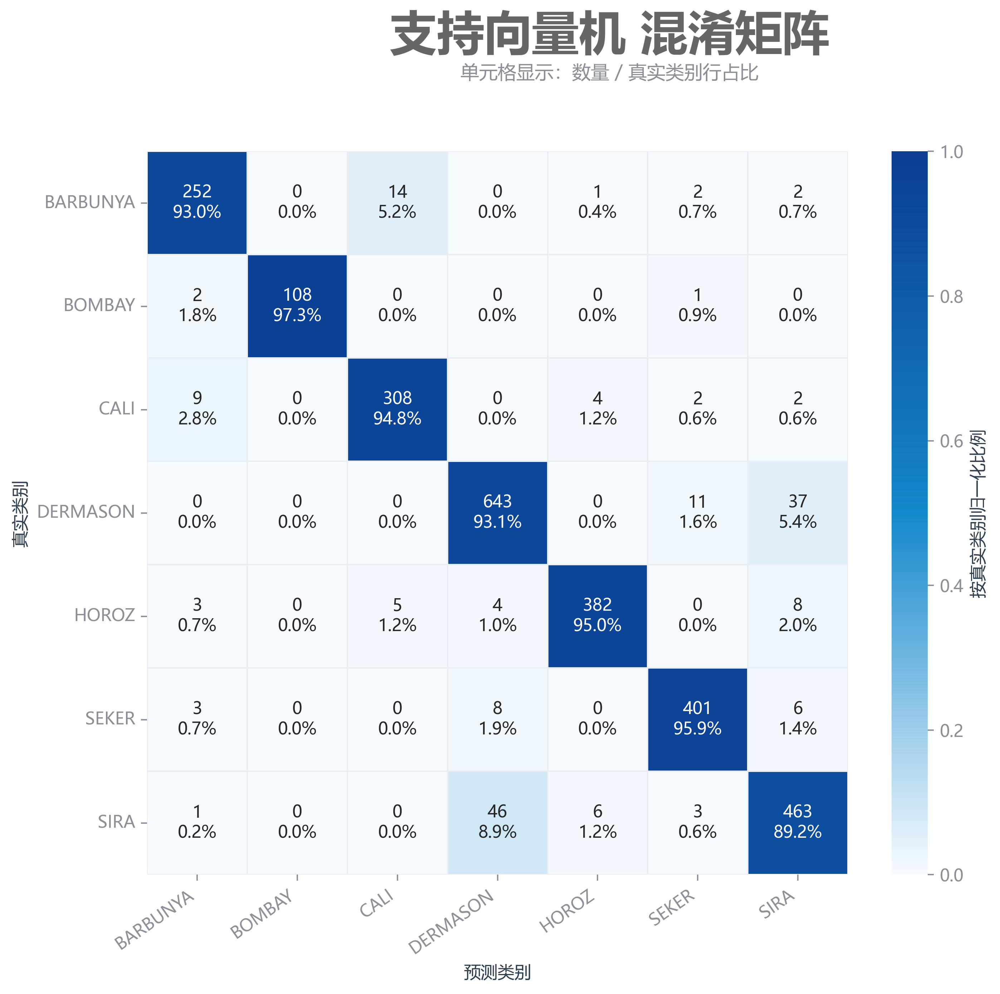

# Dry Bean Dataset 多分类机器学习系统

本项目是机器学习期末大作业，主题为 Dry Bean Dataset 多分类机器学习系统。项目从 dirty 数据出发，完成数据分析、数据清洗与特征工程、多算法实验、鲁棒性分析、推理速度分析、Streamlit 展示页面和统一命令行调用，目标是保证老师能够从 GitHub 克隆后复现实验。


## 1. 项目简介

Dry Bean Dataset 是一个干豆品种识别数据集，原始数据来自干豆图像的形态学特征提取。任务目标是根据数值特征预测豆类品种，属于多分类问题。

清洗后的 7 个标准类别：

- BARBUNYA
- BOMBAY
- CALI
- DERMASON
- HOROZ
- SEKER
- SIRA

输入特征共 16 个，主要描述豆粒的面积、周长、长轴、短轴、偏心率、凸包面积、等效直径、紧致度、圆度和形状因子等。当前项目使用 dirty 版本数据，因此包含缺失值、重复样本、标签污染、异常值、类别不平衡、特征尺度差异和强相关特征等问题。

## 项目成果速览

### 数据与实验规模

| 项目 | 数量 | 说明 |
| --- | ---: | --- |
| 总样本数 | 13,578 | 训练集、验证集与测试集合计 |
| 训练集 | 9,509 | 用于拟合预处理器和模型 |
| 验证集 | 1,332 | 用于训练过程评估 |
| 测试集 | 2,737 | 全程保持独立，仅用于最终评价 |
| 原始特征 | 16 | 干豆尺寸、轮廓与形状特征 |
| 标准类别 | 7 | BARBUNYA、BOMBAY、CALI、DERMASON、HOROZ、SEKER、SIRA |
| 对比模型 | 5 | Logistic、KNN、SVM、Random Forest、XGBoost |

### 核心模型结果

| 模型 | 训练集准确率 | 测试集准确率 | 加权 F1 | 过拟合差值 | 结论 |
| --- | ---: | ---: | ---: | ---: | --- |
| 逻辑回归 | 92.59% | 92.66% | 92.68% | -0.06% | 速度最快，泛化稳定 |
| K近邻 | 100.00% | 92.04% | 92.07% | 7.96% | 精度较好，但存在过拟合 |
| **支持向量机** | **93.91%** | **93.42%** | **93.43%** | **0.48%** | **测试精度最高，综合表现最佳** |
| 随机森林 | 100.00% | 91.85% | 91.86% | 8.15% | 训练拟合充分，泛化差距较大 |
| XGBoost | 98.46% | 92.55% | 92.56% | 5.91% | 非线性建模与鲁棒性较均衡 |

### 推理速度结果

所有模型均对相同的 2,737 条测试样本重复预测 20 次后取平均值，计时过程不包含模型训练。

| 速度排名 | 模型 | 整个测试集平均耗时 | 单样本平均耗时 | 应用特点 |
| ---: | --- | ---: | ---: | --- |
| 1 | **逻辑回归** | **0.45 ms** | **0.17 μs** | 适合实时和高并发预测 |
| 2 | K近邻 | 40.86 ms | 14.93 μs | 预测时需要计算样本距离 |
| 3 | XGBoost | 78.47 ms | 28.67 μs | 精度与速度较均衡 |
| 4 | 随机森林 | 80.57 ms | 29.44 μs | 需要汇总多棵决策树结果 |
| 5 | 支持向量机 | 312.49 ms | 114.17 μs | 精度最高，但核预测耗时较长 |

### 数据分析可视化

<table>
  <tr>
    <td width="50%" align="center"><br><b>清洗后类别分布</b></td>
    <td width="50%" align="center"><br><b>特征相关性热力图</b></td>
  </tr>
</table>

类别分布图反映 DERMASON 样本最多、BOMBAY 样本最少，因此实验同时报告准确率与加权 F1。相关性图显示 Area、Perimeter、ConvexArea 和 EquivDiameter 等尺寸特征相关性较强。

### 模型性能可视化

<table>
  <tr>
    <td width="50%" align="center"><br><b>测试集准确率对比</b></td>
    <td width="50%" align="center"><br><b>加权 F1 对比</b></td>
  </tr>
  <tr>
    <td width="50%" align="center"><br><b>模型推理时间对比</b></td>
    <td width="50%" align="center"><br><b>迭代模型损失曲线</b></td>
  </tr>
</table>

准确率和 F1 均表明 SVM 的最终分类效果最佳；逻辑回归虽然精度略低，但推理速度优势明显。损失曲线仅展示具有迭代优化过程的模型，KNN 与随机森林不伪造 loss 曲线。

### 鲁棒性可视化

| 噪声类型 | 强度设置 | 实验方法 | 主要发现 |
| --- | --- | --- | --- |
| Gaussian Noise | 0.01、0.05、0.10、0.20 | 对训练特征加入高斯扰动并重新训练 | 大多数模型精度下降较小 |
| Mask Noise | 0.01、0.05、0.10、0.20 | 随机遮蔽训练集部分特征并重新训练 | 高强度下对 Logistic 与 SVM 影响更明显 |

<table>
  <tr>
    <td width="50%" align="center"><br><b>不同噪声强度下的测试准确率</b></td>
    <td width="50%" align="center"><br><b>模型精度下降热力图</b></td>
  </tr>
</table>

鲁棒性实验只污染训练集并重新训练，测试集始终保持干净。部分低强度噪声下精度略有提升，说明噪声可能产生轻微的数据增强或正则化作用，并非人工修正结果。

### 最佳模型混淆矩阵

<p align="center">
  <br>
  <b>SVM 测试集混淆矩阵</b>
</p>

SVM 混淆矩阵的对角线最集中，说明多数样本被正确分类；主要误差发生在形态特征相近的类别之间。矩阵样本总数为 2,737，与独立测试集规模一致。

## 2. 作业评分点对应表

| 作业要求 | 本项目实现 |
| --- | --- |
| 数据分析 5% | 类别分布、缺失值、重复值、标签污染、异常值、类别不平衡、特征尺度差异、相关性分析 |
| 数据处理 30% | 缺失值填补、重复删除、标签清洗、IQR 裁剪、形态学比例特征、标签编码、标准化、保存预处理器 |
| 多算法实验 30% | 逻辑回归、KNN、SVM、随机森林、XGBoost；输出精度、F1、混淆矩阵、loss、速度、鲁棒性和过拟合分析 |
| 工程结构和展示 30% | `main.py` 统一命令行、`src` 模块化、结果自动保存、Streamlit 中文展示、上传 CSV 预测、README 复现说明 |
| 课程总结 5% | README 和自动实验报告中均包含课程总结 |

## 3. 工程结构

```text
ML_DryBean_Project/
├── data/
│   ├── train.csv
│   ├── test.csv
│   ├── val.csv
│   └── README_data.md
├── src/
│   ├── config.py
│   ├── data_loader.py
│   ├── preprocessing.py
│   ├── eda.py
│   ├── train.py
│   ├── evaluate.py
│   ├── robustness.py
│   ├── speed_test.py
│   ├── visualization.py
│   └── utils.py
├── models/
├── results/
│   ├── figures/
│   └── experiment_report.md
├── app/
│   └── streamlit_app.py
├── main.py
├── run_all.bat
├── run_app.bat
├── requirements.txt
└── README.md
```

## 4. 环境安装

```bash
pip install -r requirements.txt
```

如果只想快速运行，可以先执行：

```bash
python main.py --mode all
```

## 5. 命令行运行方式

所有实验都通过 `main.py` 统一调用，算法训练和评估阶段不会弹出 UI。

```bash
python main.py --mode eda
python main.py --mode train --model logistic
python main.py --mode train --model knn
python main.py --mode train --model svm
python main.py --mode train --model random_forest
python main.py --mode train --model xgboost
python main.py --mode train_all
python main.py --mode evaluate_all
python main.py --mode robustness
python main.py --mode speed
python main.py --mode all
```

Windows 下可双击：

- `run_all.bat`：一键运行完整实验
- `run_app.bat`：启动 Streamlit 页面

## 6. 数据分析输出

运行：

```bash
python main.py --mode eda
```

会生成：

- `results/experiment_report.md`
- `results/class_distribution.csv`
- `results/missing_values.csv`
- `results/outlier_summary.csv`
- `results/figures/class_distribution.png`
- `results/figures/feature_correlation_heatmap.png`

报告会描述数据来源、任务目标、样本数量、训练/测试/验证划分、特征含义、类别不平衡、缺失值、重复样本、标签污染、异常值、尺度差异和特征相关性。

## 7. 数据处理方法

数据处理真实写在 `src/preprocessing.py` 中，核心原则是只在训练集 `fit`，测试集、验证集和上传预测只 `transform`，避免数据泄漏。

已实现：

- 缺失值处理：训练集 median 填补
- 重复样本处理：训练集删除重复行
- 标签污染清洗：统一大小写、去除空格、修复 `0/O`、`3/E`
- 异常值处理：训练集拟合 IQR 上下界，测试集复用该上下界进行裁剪
- 特征工程：新增形态学比例特征，如 `Area/Perimeter`、`MajorAxisLength/MinorAxisLength`、`ConvexArea/Area`
- 标准化：`StandardScaler`
- 标签编码：`LabelEncoder`
- 持久化：保存预处理器、标签编码器、最终特征列和原始特征列

异常值说明：IQR 检测出的极端值不一定都是错误数据，因为不同干豆类别在形态学特征上确实可能差异较大。本项目采用训练集 IQR 上下界裁剪，而不是直接删除大量样本，既减少极端值影响，又保留数据量。

## 8. 算法列表

课堂内算法：

- Logistic Regression
- KNN
- SVM

课堂外扩展算法：

- Random Forest
- XGBoost

每个模型会输出训练集准确率、测试集准确率、precision、recall、F1-score、训练时间、推理时间、混淆矩阵和过拟合分析。

## 9. 实验结果文件

完整运行：

```bash
python main.py --mode all
```

核心输出：

- `results/metrics_summary.csv`
- `results/experiment_report.md`
- `results/speed_summary.csv`
- `results/robustness_summary.csv`
- `results/figures/accuracy_comparison.png`
- `results/figures/f1_comparison.png`
- `results/figures/loss_comparison.png`
- `results/figures/speed_comparison.png`
- `results/figures/robustness_comparison.png`
- `results/figures/robustness_drop_heatmap.png`
- `results/figures/confusion_matrix_模型名.png`

Loss 曲线说明：

- Logistic Regression 使用 `SGDClassifier(loss="log_loss")` 按 epoch 记录训练/测试 log loss，用于展示训练过程。
- XGBoost 使用 `eval_set` 记录 multi-class logloss。
- KNN、Random Forest 等非梯度 epoch 训练模型在结果表中标记为 N/A，不伪造 loss 曲线。

鲁棒性分析说明：

- 噪声类型：Gaussian Noise、Mask Noise / Feature Dropout Noise
- 噪声强度：0.01、0.05、0.10、0.20
- 实验流程：训练数据加噪，重新训练模型，在干净测试集上评估精度下降
- 如果低强度噪声下准确率略微上升，报告中会解释为轻微数据增强效果，不作为错误处理。

## 10. 实验结果摘要

完整结果以 `results/metrics_summary.csv` 为准。该表包含模型准确率、加权精确率、加权召回率、加权 F1、训练时间、推理时间、过拟合差值、模型优点、模型缺点和最终评价。一般来说，SVM 和 XGBoost 在测试准确率上表现较强；逻辑回归推理速度快且稳定；KNN 和随机森林可作为对照模型观察过拟合和推理速度差异。

## 11. 过拟合分析说明

项目用 `overfit_gap = train_accuracy - test_accuracy` 衡量过拟合程度：

- gap < 0.01：低
- 0.01 <= gap < 0.05：中
- gap >= 0.05：高

如果 gap 较大，说明模型在训练集上记忆较多，泛化风险更高；如果训练集和测试集都较低，则可能存在欠拟合。

## 12. Streamlit 展示页面

启动：

```bash
streamlit run app/streamlit_app.py
```

如果默认端口不可用：

```bash
python -m streamlit run app/streamlit_app.py --server.address=127.0.0.1 --server.port=8502
```

页面展示：

- 数据集介绍
- 数据污染和处理流程
- 算法说明
- 指标总表
- loss 曲线
- 鲁棒性图
- 速度图
- 混淆矩阵
- 上传 CSV 预测

上传 CSV 预测说明：

- 上传文件只需要包含干豆原始特征列，不需要包含 `Class`。
- 预测阶段只加载已经保存的模型、预处理器、标签编码器和特征列，不会重新训练模型。
- 预测结果第一列为预测类别，第二列为预测置信度，置信度固定保留 4 位小数。

## 13. GitHub 上传说明

当前 GitHub 链接：待上传后填写。  
当前在线展示链接：待部署后填写。

上传步骤示例：

```bash
git init
git add .
git commit -m "Complete Dry Bean ML project"
git branch -M main
git remote add origin 你的仓库地址
git push -u origin main
```

上传前建议不要删除 `results/` 中的关键结果文件，因为老师打开仓库即可看到已经生成的图表和报告。

## 14. 论文截图

大论文中建议单独设置“工程系统与网页展示”一章，截图包括：

- 项目目录结构
- 命令行运行 `python main.py --mode all`
- Streamlit 项目概览页
- EDA 页面：类别分布和相关性热力图
- 模型结果页：指标表、accuracy/F1 图、loss 图
- 鲁棒性与速度页面
- 上传 CSV 预测页面
- GitHub 仓库页面

## 15. 课程总结

通过这门课和这个项目，我把课堂里学到的分类算法真正串成了一个完整流程。以前我更关注模型怎么写、准确率是多少，现在更能理解数据清洗、特征工程、训练/测试隔离、过拟合分析、鲁棒性和工程复现同样重要。这个项目也让我练习了把实验结果整理成报告和网页展示的过程。

我觉得课程整体比较实用，能帮助我建立机器学习项目的基本思路。
